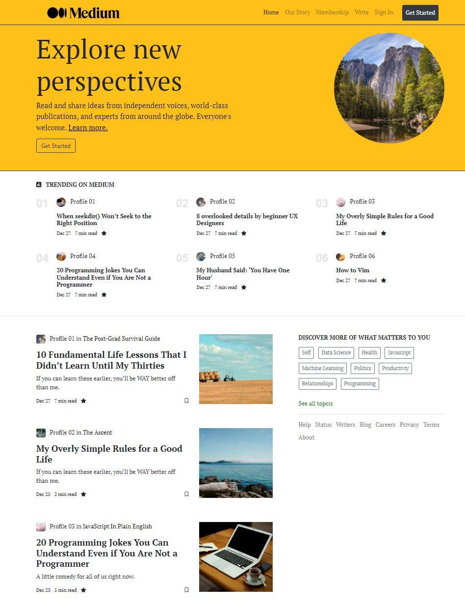

# Bootstrap ile Medium Klonu

Bu repo [Kodluyoruz](https://www.kodluyoruz.org) [Patika-Bootsrap](https://app.patika.dev/courses/bootstrap) eğitimleri kapsamında olup; (eğitmenle birlikte) bir Medium klonu hazırlanması çalışmasıdır.

## Çalışma İndirme Linki

[Çalışma Klasörü Linki (Dropbox)](https://www.dropbox.com/sh/07hh7eukqcjwu0g/AABI2WiOiq889ef2ikjdDhcga?dl=0)

* Eğitimlerde oluşturulan projeler ve ödevler kategorize edilerek tek bir repo (eğitim reposu) içerisinde klasörlenmiştir.

* İlgili çalışmalara ait klasörlerin eğitmen/denetmenlerce rahatça indirilerek incelenebilmesi için kendine ait depolama/bulut linkleri yukarıdaki gibi verilmiştir.

## Preview

