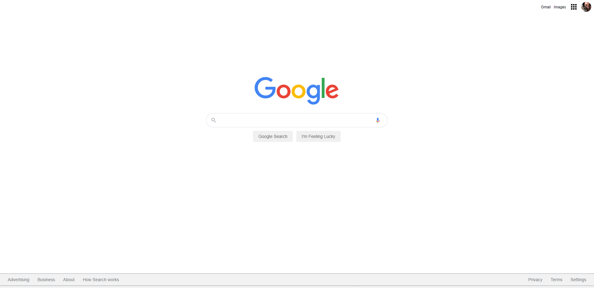

# Google 98 Stil Klonlama

Bu repo [Kodluyoruz](https://www.kodluyoruz.org) [Patika-CSS](https://app.patika.dev/courses/css/) eğitimlerinde [Google (Güncel)](http://www.google.com/) stilinde bir site oluşturulması konulu 3. ödev içeriğidir.

## Çalışma İndirme Linki

[Çalışma Klasörü Linki (Dropbox)](https://www.dropbox.com/sh/60nr1sfqkj5red3/AACNWsRiFcLXV3mI-7BlDA-Za?dl=0)

* Eğitimlerde oluşturulan projeler ve ödevler kategorize edilerek tek bir repo (eğitim reposu) içerisinde klasörlenmiştir.

* İlgili çalışmalara ait klasörlerin eğitmen/denetmenlerce rahatça indirilerek incelenebilmesi için kendine ait depolama/bulut linkleri yukarıdaki gibi verilmiştir.

## Preview

