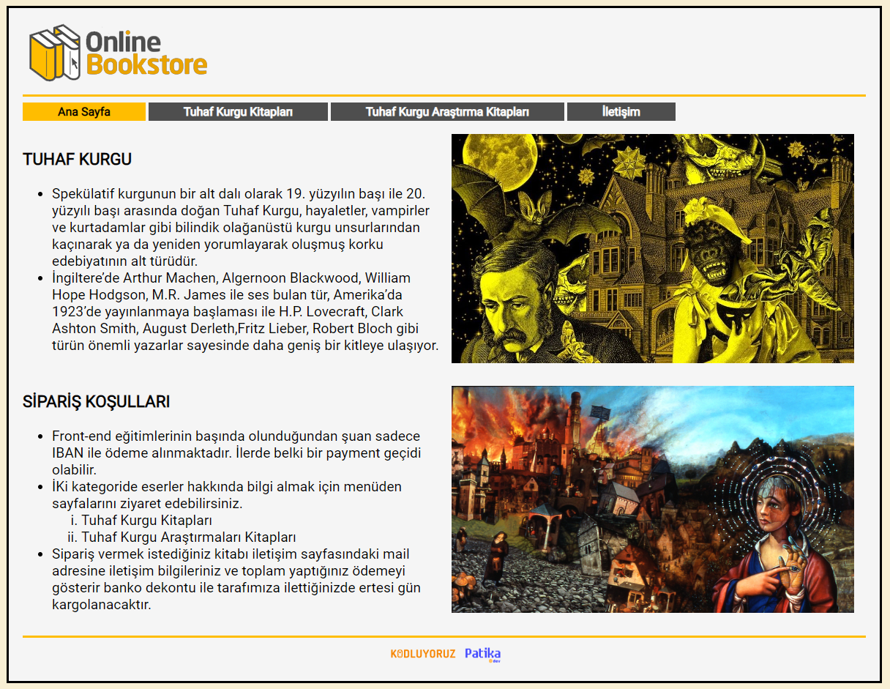

# Site Makyajlama

Bu repo [Kodluyoruz](https://www.kodluyoruz.org) [Patika-CSS](https://app.patika.dev/courses/css/) eğitimlerinde örnek bir site oluşturulması ve CSS stillerinin uygulanması konulu 1. ödev içeriğidir.
---
## Çalışma İndirme Linki

[Dropbox' dan klasörü indir](https://www.dropbox.com/sh/4agoaa15dbbobwx/AACg1gWsS13YWXKQVJMtB0yDa?dl=0)
---
## Preview

---
