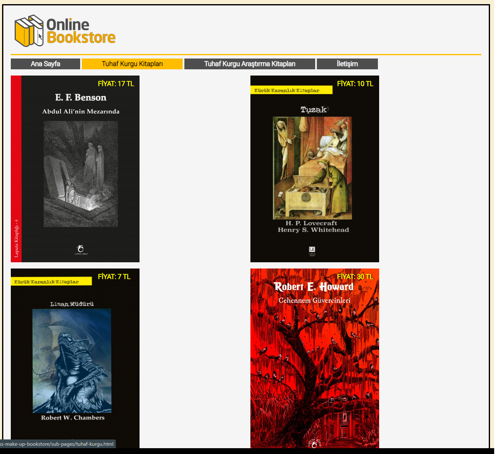

# Site Makyajlama

Bu repo [Kodluyoruz](https://www.kodluyoruz.org) [Patika-CSS](https://app.patika.dev/courses/css/) eğitimlerinde örnek bir site oluşturulması ve CSS stillerinin uygulanması konulu 1. ödev içeriğidir.

## Çalışma İndirme Linki

[Çalışma Klasörü Linki (Dropbox)](https://www.dropbox.com/sh/4agoaa15dbbobwx/AACg1gWsS13YWXKQVJMtB0yDa?dl=0)

* Eğitimlerde oluşturulan projeler ve ödevler kategorize edilerek tek bir repo (eğitim reposu) içerisinde klasörlenmiştir.
* İlgili çalışmalara ait klasörlerin eğitmen/denetmenlerce rahatça indirilerek incelenebilmesi için kendine ait depolama/bulut linkleri yukarıdaki gibi verilmiştir.

## Preview

