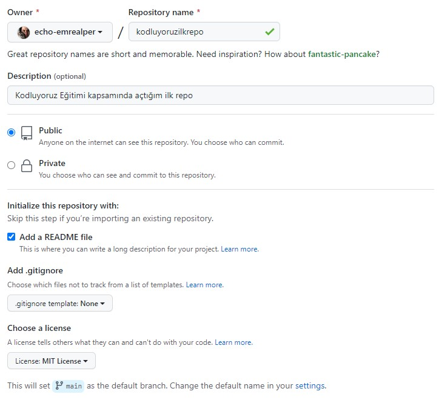

# İlk Repo

 * Bu repo [Kodluyoruz](https://www.kodluyoruz.org) [Git](https://app.patika.dev/courses/git) eğitimlerinde oluşturduğumuz ilk repodur.

 * İçerisinde bir adet README dosyası ve bir adet de index. html sayfası barındırmaktadır.

## Çalışma İndirme Linki

* Eğitimlerde oluşturulan projeler ve ödevler kategorize edilerek tek bir repo (eğitim reposu) içerisinde klasörlenmiştir.
* İlgili çalışmalara ait klasörlerin eğitmen/denetmenlerce rahatça indirilerek incelenebilmesi için kendine ait depolama/bulut linkleri yukarıdaki gibi verilmiştir.

[Dropbox' dan klasörü indir](https://www.dropbox.com/sh/dnyiaetwmmiuknd/AACAenWPL8XID_-MegdiXdO9a?dl=0)

## Preview



## Installation

Öncelikle projeyi clonelayınız.

```bash
git clone https://github.com/echo-emrealper/kodluyoruzilkrepo.git
```
## Usage

Projeyi cloneladıktan sonra Visual Studio Code programında açınız.

*Linux için:*
```linux
cd kodluyoruzilkrepo
code .
```

## Contributing

* Pull requestler kabul edilir. 
* Büyük değişiklikler için, lütfen önce neyi değiştirmek istediğinizi tartışmak için bir konu açınız.

## License
[MIT](https://choosealicense.com/licenses/mit/)
