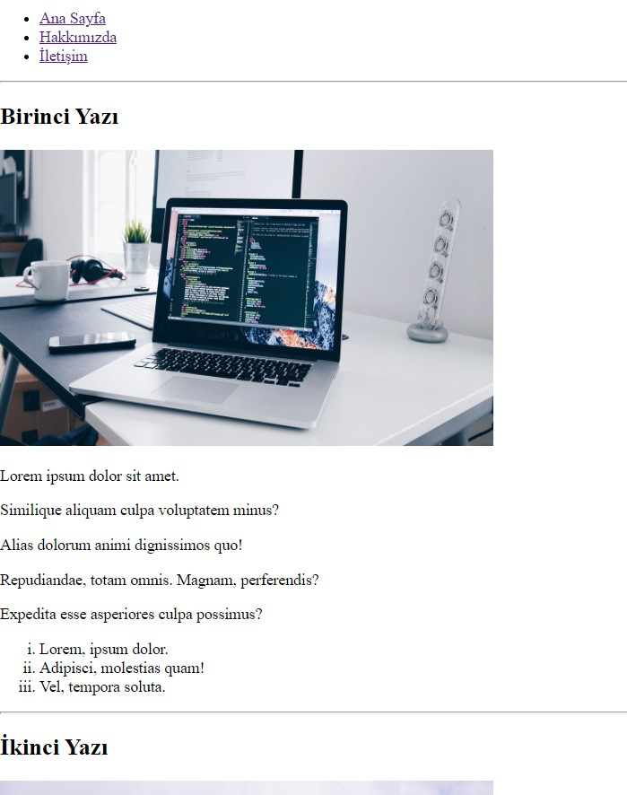

# HTML Bölüm Sonu Çalışması

 * Bu repo [Kodluyoruz](https://www.kodluyoruz.org) [HTML](https://app.patika.dev/courses/html) eğitimlerinde oluşturduğumuz bölüm sonu çalışmasıdır.

 * İçerisinde:
    * Bir adet index.html sayfası,
    * Bir adet about-us.html sayfası,
    * Bir adet contact.html sayfası,
    * Bir adet README dosyası barındırmaktadır.

## Çalışma İndirme Linki

[Dropbox' dan klasörü indir](https://www.dropbox.com/sh/b6u8oc0xgyjqf4y/AAAcam5E_Oh11L33g2m1zsDTa?dl=0)

* Eğitimlerde oluşturulan projeler ve ödevler kategorize edilerek tek bir repo (eğitim reposu) içerisinde klasörlenmiştir.
* İlgili çalışmalara ait klasörlerin eğitmen/denetmenlerce rahatça indirilerek incelenebilmesi için kendine ait depolama/bulut linkleri yukarıdaki gibi verilmiştir.

## Preview

