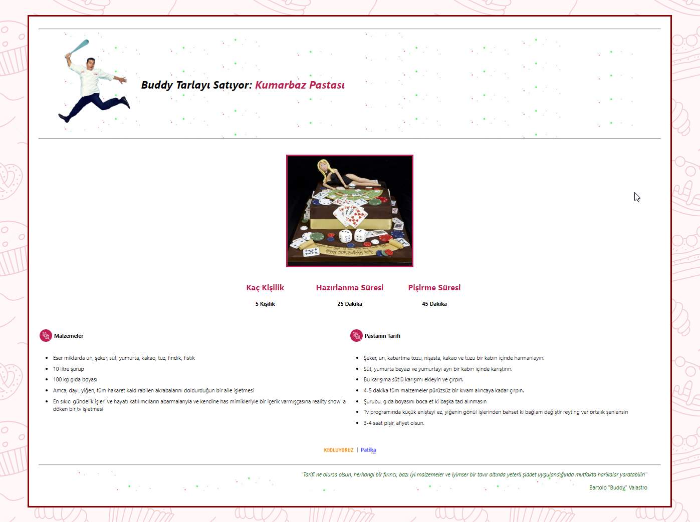

# Pasta Tarifi Sayfası Tasarlanması

 * Bu repo [Kodluyoruz](https://www.kodluyoruz.org) [HTML](https://app.patika.dev/courses/html) eğitimlerinde oluşturduğumuz bölüm sonu çalışmasıdır.

 * İçerisinde:
    * Bir adet index.html sayfası,
    * Bir adet README dosyası barındırmaktadır.

* İçeriğin (bir pastanın tarifi) tam sayfa kullanımı için fazla büyük olacağı düşüncesi ile estetik açıdan sayfanın ortasında bir kart şeklinde tasarlanması daha uygun bulundu

* CSS eğitimi alınmadığından yerleşim problemi tablolar vasıtası ile giderilmeye çalışıldı.

## Çalışma İndirme Linki

[Çalışma Klasörü Linki (Dropbox)](https://www.dropbox.com/sh/ofysdpw3krkt6jc/AAAKbEtaKSOSuQZ0jZ09JjWCa?dl=0)

* Eğitimlerde oluşturulan projeler ve ödevler kategorize edilerek tek bir repo (eğitim reposu) içerisinde klasörlenmiştir.

* İlgili çalışmalara ait klasörlerin eğitmen/denetmenlerce rahatça indirilerek incelenebilmesi için kendine ait depolama/bulut linkleri yukarıdaki gibi verilmiştir.

## Preview

