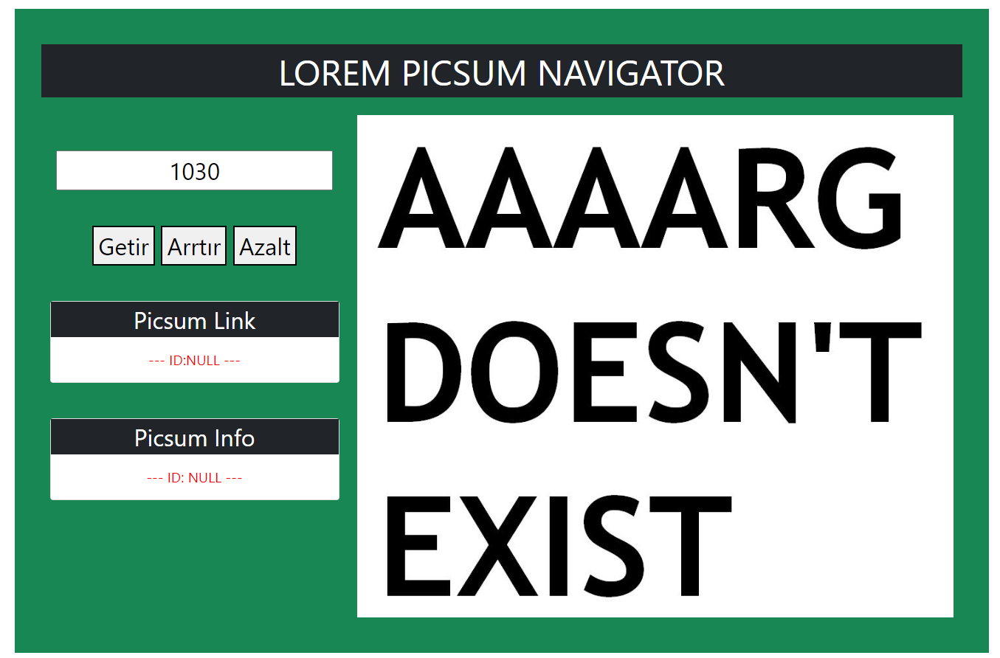

# Javascript ile Saat ve Karşılama

Bu repo [Kodluyoruz](https://www.kodluyoruz.org) [Patika-JS](https://app.patika.dev/courses/javascript) eğitimleri kapsamındadır.

## Çalışma İndirme Linki

[Çalışma Klasörü Linki (Dropbox)]()

* Eğitimlerde oluşturulan projeler ve ödevler kategorize edilerek tek bir repo (eğitim reposu) içerisinde klasörlenmiştir.

* İlgili çalışmalara ait klasörlerin eğitmen/denetmenlerce rahatça indirilerek incelenebilmesi için kendine ait depolama/bulut linkleri yukarıdaki gibi verilmiştir.

## Preview

