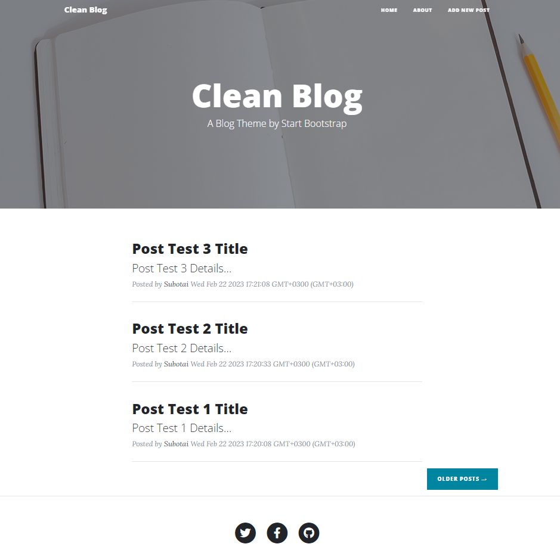
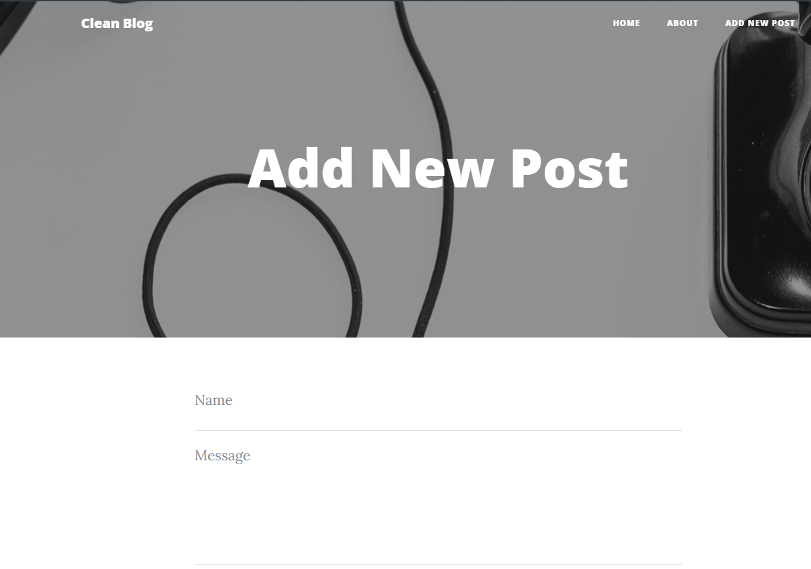
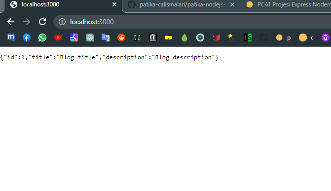

# Node.JS ile Clean Blog Projesi

Bu repo [Kodluyoruz](https://www.kodluyoruz.org) [Patika-Node.JS](https://app.patika.dev/courses/nodejs) eğitimleri kapsamındadır.

## Çalışma İndirme Linki

[Çalışma Klasörü Linki (Dropbox)]()

* Eğitimlerde oluşturulan projeler ve ödevler kategorize edilerek tek bir repo (eğitim reposu) içerisinde klasörlenmiştir.

* İlgili çalışmalara ait klasörlerin eğitmen/denetmenlerce rahatça indirilerek incelenebilmesi için kendine ait depolama/bulut linkleri yukarıdaki gibi verilmiştir.

## Preview

#### Node.JS HW09 - Update (MongoDB & Mongoose & Models)

#### Node.JS HW08 - Update (Template Engines & Static Files)

#### Node.JS HW07 - Update (Workspace)
