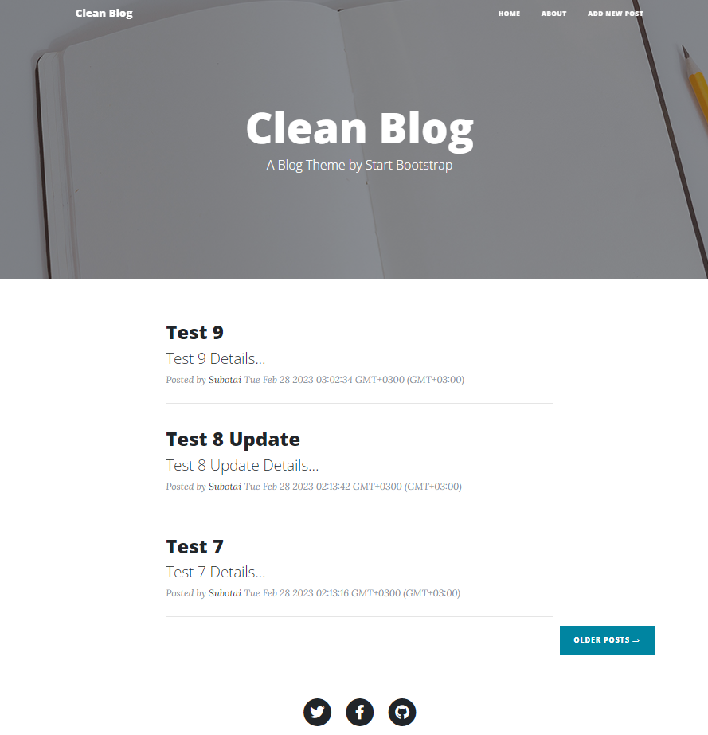
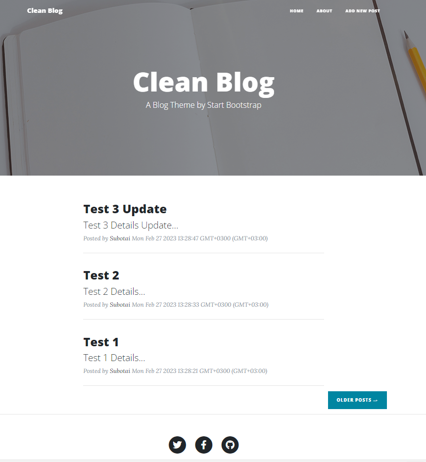
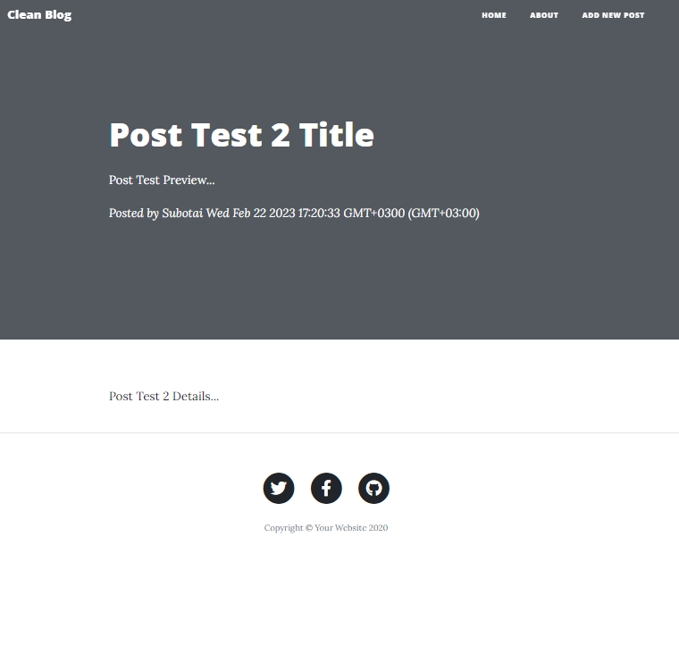

# Node.JS ile Clean Blog Projesi

Bu repo [Kodluyoruz](https://www.kodluyoruz.org) [Patika-Node.JS](https://app.patika.dev/courses/nodejs) eğitimleri kapsamındadır.

## Preview
#### Node.JS HW12 - Update (Pagination)

#### Node.JS HW11 - Update (MVC)

#### Node.JS HW10 - Update (Posts Page Templates)

#### Node.JS HW09 - Update (MongoDB & Mongoose & Models)

#### Node.JS HW08 - Update (Template Engines & Static Files)

#### Node.JS HW07 - Update (Workspace)
