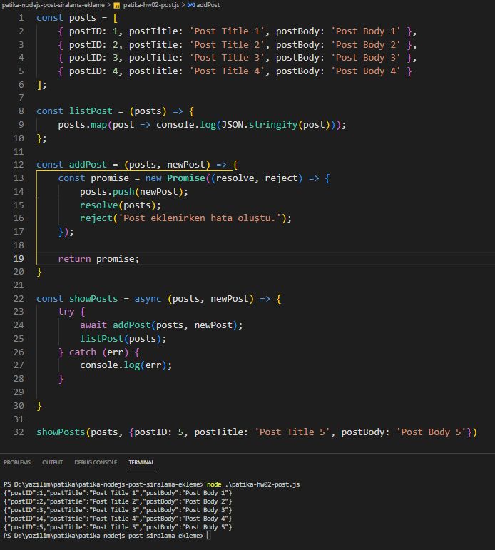

# Node.JS ile Post Sıralama ve Post Ekleme

Bu repo [Kodluyoruz](https://www.kodluyoruz.org) [Patika-Node.JS](https://app.patika.dev/courses/nodejs) eğitimleri kapsamındadır.

## Çalışma İndirme Linki

[Çalışma Klasörü Linki (Dropbox)](https://www.dropbox.com/sh/ixwmtgzr7gm50a9/AAC4TL4037G6w_yz3zdXKaKma?dl=0)

* Eğitimlerde oluşturulan projeler ve ödevler kategorize edilerek tek bir repo (eğitim reposu) içerisinde klasörlenmiştir.

* İlgili çalışmalara ait klasörlerin eğitmen/denetmenlerce rahatça indirilerek incelenebilmesi için kendine ait depolama/bulut linkleri yukarıdaki gibi verilmiştir.

## Preview

