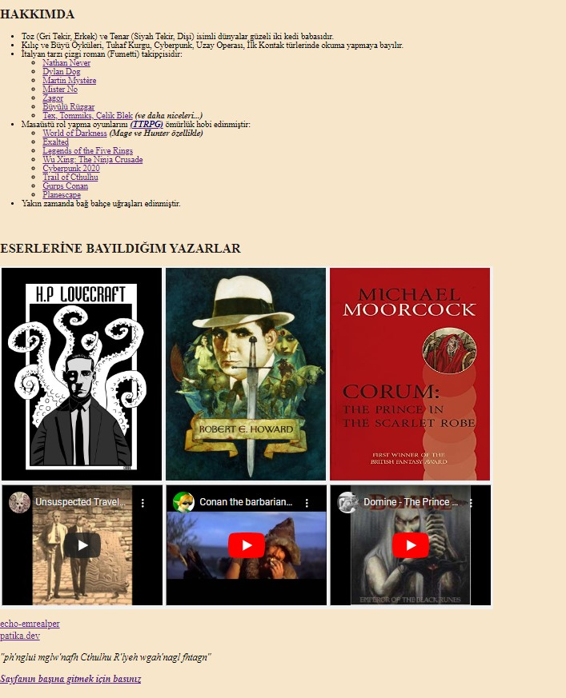

# Kodluyoruz Ilk Web Sayfası

 * Bu repo [Kodluyoruz](https://www.kodluyoruz.org) [HTML](https://app.patika.dev/courses/html) eğitimlerinde oluşturduğumuz ilk web sayfasına ait repodur.

 * İçerisinde bir adet README dosyası ve bir adet de index. html sayfası barındırmaktadır.

 * Konular ilerledikçe güncellemeler gerçekleştirilecektir.

---
## Preview




---
## Installation

Öncelikle projeyi clonelayınız.

```bash
git clone https://github.com/echo-emrealper/who-is-echo-emrealper
```
---
## Usage

Projeyi cloneladıktan sonra Visual Studio Code programında açınız.

*Linux için:*
```linux
cd who-is-echo-emrealper
code .
```
---
## Contributing

* Pull requestler kabul edilir. 
* Büyük değişiklikler için, lütfen önce neyi değiştirmek istediğinizi tartışmak için bir konu açınız.

---
## License
[MIT](https://choosealicense.com/licenses/mit/)